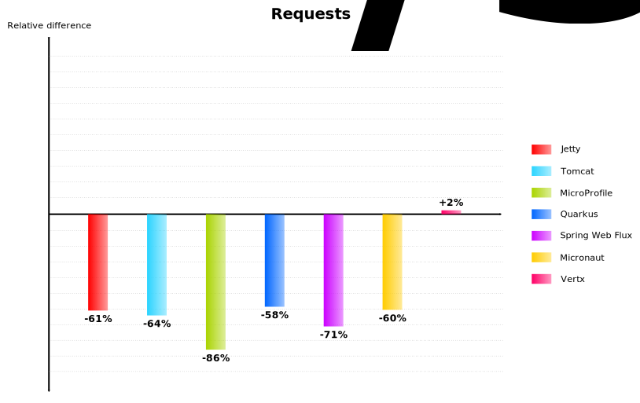

# Framework Benchmarks

This project contains test projects using various frameworks or containers in order to compare raw HTTP performances.

Benchmarking is a difficult thing because it is very hard to compare two different implementations which have both strength and weakness but above all that might have been designed with different concerns. Application configuration and optimization is also a factor to consider. Results must then be taken with caution using a both qualitative and quantitative approach.

That being said, test applications are meant to be as simple as they can be and the test focuses on raw HTTP performances which is specific enough to provide accurate results.

Here are the results of the [latest run](runs/20210429):




## The Test project

The test project consists of a single `/hello` resource which responds with *Hello World* on a `GET` HTTP/1.1 request.

For instance:

```
curl http://localhost:8080/hello
Hello World
```

## The Test

Each test projects are started one after the other on a bare metal computer with `n` processor cores using latest OpenJDK using the default configuration (ie. no `-X...` settings).

> Note that a special mention is made for frameworks that doesn't support latest versions of OpenJDK

> Some frameworks support native image generation using GraalVM, test projects are run using the JVM to compare like with like. Native images reduce startup time and memory comsumption but the impact on runtime performances should be limited.

The test consists of a series of runs targeting the HTTP resource executed on the same computer.

A run is performed using [wrk](https://github.com/wg/wrk) HTTP benchmarking tool, it lasts 15 seconds with 256 connections using `n` threads.

For instance, on a 8 processor cores computer, a run is performed with the following command:

```
$ wrk -H "Host: localhost" -H "Accept: */*" -H "Connection: keep-alive" --latency -d 15 -c 256 --timeout 8 -t 8 http://localhost:8080/hello
```

A blank run is performed first to warm up the application (JIT compiler...), then a series of 5 runs, 30 seconds apart, is started. 

The best requests/sec rate is then retained as performance indicator.

## Results

[Results](runs/) are presented in a graph showing the performance of the various frameworks and containers relative to Inverno framework.

