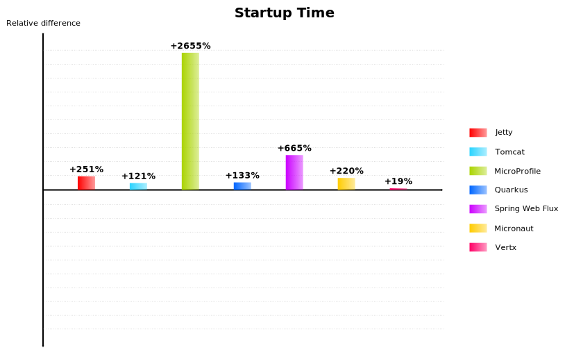

# Run 2021-04-29

- **CPU**: Intel(R) Xeon(R) CPU E3-1505M v5 @ 2.80GHz
- **Memory**: 32GB
- **JDK**:
```
openjdk version "16" 2021-03-16
OpenJDK Runtime Environment (build 16+36-2231)
OpenJDK 64-Bit Server VM (build 16+36-2231, mixed mode, sharing)
```

> \* OpenJDK 11.0.7
> ```
> java version "11.0.7" 2020-04-14 LTS
> Java(TM) SE Runtime Environment 18.9 (build 11.0.7+8-LTS)
> Java HotSpot(TM) 64-Bit Server VM 18.9 (build 11.0.7+8-LTS, mixed mode)
> ```

## Requests/sec

<table style="margin:2rem auto;">
	<tr>
		<th></th>
		<th>Requests/<sub>sec</sub></th>
		<th>Relative Change</th>
	</tr>
	<tr style="font-weight: bold;">
		<td>Inverno</td>
		<td style="text-align: right;">330369.03</td>
		<td style="text-align: center;">0%</td>
	</tr>
	<tr style="border-top-width: 5px;">
		<td>Jetty</td>
		<td style="text-align: right;">129146.44</td>
		<td style="text-align: center;">- 60.91%</td>
	</tr>
	<tr>
		<td>Tomcat</td>
		<td style="text-align: right;">118818.11</td>
		<td style="text-align: center;">- 64.03%</td>
	</tr>
	<tr>
		<td>MicroProfile *</td>
		<td style="text-align: right;">46779.58</td>
		<td style="text-align: center;">- 85.84%</td>
	</tr>
	<tr>
		<td>Quarkus</td>
		<td style="text-align: right;">137176.63</td>
		<td style="text-align: center;">- 58.48%</td>
	</tr>
	<tr>
		<td>Spring Web Flux</td>
		<td style="text-align: right;">95722.53</td>
		<td style="text-align: center;">- 71.03%</td>
	</tr>
	<tr>
		<td>Micronaut</td>
		<td style="text-align: right;">130696.21</td>
		<td style="text-align: center;">- 60.44%</td>
	</tr>
	<tr>
		<td>Vertx</td>
		<td style="text-align: right;">336919.28</td>
		<td style="text-align: center;">+ 1.98%</td>
	</tr>
</table>


## Startup time

<table style="margin:2rem auto;">
	<tr>
		<th></th>
		<th>Startup time (ms)</th>
		<th>Relative Change</th>
	</tr>
	<tr style="font-weight: bold;">
		<td>Inverno</td>
		<td style="text-align: right;">224</td>
		<td style="text-align: center;">0%</td>
	</tr>
	<tr style="border-top-width: 5px;">
		<td>Jetty</td>
		<td style="text-align: right;">787</td>
		<td style="text-align: center;">+ 251.34%</td>
	</tr>
	<tr>
		<td>Tomcat</td>
		<td style="text-align: right;">495</td>
		<td style="text-align: center;">+ 120.98%</td>
	</tr>
	<tr>
		<td>MicroProfile *</td>
		<td style="text-align: right;">6172</td>
		<td style="text-align: center;">+ 2655.36%</td>
	</tr>
	<tr>
		<td>Quarkus</td>
		<td style="text-align: right;">523</td>
		<td style="text-align: center;">+ 133.48%</td>
	</tr>
	<tr>
		<td>Spring Web Flux</td>
		<td style="text-align: right;">1713</td>
		<td style="text-align: center;">+ 664.73%</td>
	</tr>
	<tr>
		<td>Micronaut</td>
		<td style="text-align: right;">717</td>
		<td style="text-align: center;">+ 220.09%</td>
	</tr>
	<tr>
		<td>Vertx</td>
		<td style="text-align: right;">267</td>
		<td style="text-align: center;">+ 19.20%</td>
	</tr>
</table>


